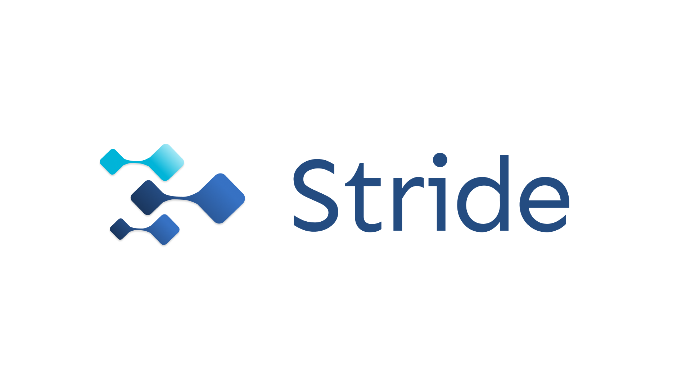

<div align="center">
  
</div>
<div align="center">
</h1>

  <a href="https://github.com/bmariscotes-strat/bmariscotes-mini-project-2/releases">
    
  <a href="https://wryte-blog.vercel.app">
    
  </a>

#### [View Live Site](https://stride-pm.app)

</div>

A team collaboration and project management platform featuring Kanban boards, comprehensive task management, real-time communication, role-based access control, and analytics to help teams organize workflows and track project progress efficiently.

<br>

## 🌟 Features

### Core Functionality

- **User Authentication & Onboarding** - Secure registration and login with email using Clerk authentication
- **Team Management** - Create personal and custom teams with role-based member management
- **Project Creation** - Set up projects with default Kanban boards and team assignments
- **Task Management** - Create, edit, and organize tasks with rich descriptions, priorities, and labels

### Access Control & Security

- **Role-Based Access Control (RBAC)** - Admin, Member, and Viewer permissions across teams and projects
- **Audit Trails** - Complete activity tracking and notification system for all changes
- **Account Security** - Password management, session tracking, and security settings

### Work Views & Organization

- **Kanban Board View** - Drag-and-drop task management with visual columns
- **Calendar Views** - Personal and project calendars with drag-and-drop functionality
- **Search & Filtering** - Find tasks by title, assignee, priority, labels, and due dates
- **Upcoming Deadlines** - Quick view of the 5 most urgent tasks

### Collaboration & Communication

- **Task Comments** - Discussion threads with @mentions for team members
- **Email Invitations** - Invite team members with automatic role assignment
- **Real-time Updates** - Live notifications for task changes and assignments

### Analytics & Insights

- **Project Analytics** - Completion percentages, timeline tracking, and performance metrics
- **Dashboard** - Overview of recent activity, quick actions, and project status

### Customization

- **Profile Management** - Update personal information, avatars, and preferences
- **Theme Options** - Light mode, dark mode, or system preference

<br>

## ⚙️ Tech Stack

| Category             | Technologies                                                                                                         |
| -------------------- | -------------------------------------------------------------------------------------------------------------------- |
| Frontend             | [Next.js](https://nextjs.org/), [React](https://reactjs.org/), [TypeScript](https://www.typescriptlang.org/)         |
| Backend              | [Drizzle ORM](https://orm.drizzle.team/), [Neon Postgres](https://neon.tech/)                                        |
| Authentication       | [Clerk](https://clerk.com/)                                                                                          |
| Database             | [Neon Database](https://neon.tech/) (Serverless PostgreSQL)                                                          |
| Styling              | [Tailwind CSS](https://tailwindcss.com/), [Radix UI](https://www.radix-ui.com/), [shadcn/ui](https://ui.shadcn.com/) |
| Animations           | [GSAP](https://gsap.com/), [Radix UI](https://swiperjs.com/)                                                         |
| Icons                | [Lucide React](https://lucide.dev/)                                                                                  |
| State Management     | [Zustand](https://zustand-demo.pmnd.rs/), [TanStack Query](https://tanstack.com/query/)                              |
| Forms & Validation   | [React Hook Form](https://react-hook-form.com/), [Zod](https://zod.dev/)                                             |
| Rich Text Editor     | [Tiptap](https://tiptap.dev/)                                                                                        |
| Drag & Drop          | [DND Kit](https://dndkit.com/)                                                                                       |
| Calendar             | [React Big Calendar](https://cloudinary.com/)                                                                        |
| Charts & Analytics   | [Recharts](https://recharts.org/)                                                                                    |
| Media Service        | [Cloudinary](https://recharts.org/)                                                                                  |
| Real-time Features   | [Pusher](https://pusher.com/)                                                                                        |
| File Processing      | [SheetJS](https://sheetjs.com/) (Excel files)                                                                        |
| Animations           | [GSAP](https://gsap.com/), [Swiper](https://swiperjs.com/)                                                           |
| Notifications        | [Sonner](https://sonner.emilkowal.ski/)                                                                              |
| Webhooks             | [Svix](https://www.svix.com/)                                                                                        |
| Testing              | [Jest](https://jestjs.io/)                                                                                           |
| Code Quality         | [ESLint](https://eslint.org/), [TypeScript](https://www.typescriptlang.org/)                                         |
| Version Management   | [Semantic Release](https://semantic-release.gitbook.io/)                                                             |
| Deployment & Hosting | [Vercel](https://vercel.com/)                                                                                        |
| Domain               | [Name.com](https://www.name.com/)                                                                                    |

<br>

## 📖 Documentation

For detailed project documentation, API references, and development guides, visit the comprehensive documentation:

**[📚 Stride Documentation](https://stratpoint.slite.com/app/docs/WQ3kxRoIJ12fOM/Stride-Documentation)**

This documentation includes:

- Project overview and architecture
- Setup and installation guides
- Development workflows
- Deployment procedures

<br>

## 🗂️ Project Structure

```
stride/
├── __tests__/                    # Test files and test utilities
├── .github/                      # GitHub workflows and CI/CD configurations
├── .next/                        # Next.js build output and cache files
├── app/                          # Next.js App Router directory
│   ├── (dashboard)/              # Route group for authenticated dashboard pages
│   ├── (guest)/                  # Route group for unauthenticated public pages
│   ├── api/                      # API route handlers
│   ├── layout.tsx                # Root layout component
│   └── page.tsx                  # Home page component
├── components/                   # Reusable React components
├── contexts/                     # React Context providers
├── drizzle/                      # Database migration and schema files
├── hooks/                        # Custom React / Tanstack hooks
├── lib/                          # Shared utility functions and configurations
│   ├── actions/                  # Server actions for form handling and mutations
│   ├── cache/                    # Caching utilities and configurations
│   ├── constants/                # Application constants and configuration values
│   ├── data/                     # Data fetching functions and queries
│   ├── db/                       # Database connection and query utilities
│   ├── permissions/              # Authorization and permission checking logic
│   ├── services/                 # External service integrations and API clients
│   ├── templates/                # Email, PDF, or other template files
│   ├── ui/                       # Reusable UI components and primitives
│   ├── utils/                    # General utility functions
│   ├── validations/              # Zod form validation schemas and rules
│   ├── websocket/                # WebSocket connection and event handlers
│   └── utils.ts                  # Main utility functions file
├── public/                       # Static assets (images, icons, etc.)
├── stores/                       # State management stores
│   ├── ui/                       # UI state stores (modals, themes, etc.)
│   └── views/                    # View-specific state stores
├── styles/                       # CSS and styling files
├── types/                        # TypeScript type definitions
├── .gitignore                   # Git ignore rules
├── .releaserc.json              # Semantic release configuration
├── components.json              # UI component library configuration
├── drizzle.config.ts            # Drizzle ORM configuration
├── jest.config.js               # Jest testing framework configuration
├── middleware.ts                # Next.js middleware for request processing
├── next-env.d.ts                # Next.js TypeScript declarations
└── next.config.ts               # Next.js framework configuration
```

<br>

## 📬 Contact

Want to collaborate or have feedback? Reach out via:

- 📧 [bm.mariscotes@gmail.com](mailto:your-email@gmail.com)
- 🌐 [LinkedIn](https://linkedin.com/in/biellamariscotes)
- 💻 [GitHub](https://github.com/biellamariscotes)

---

_© 2025 Biella Mariscotes. All rights reserved._

<hr>
